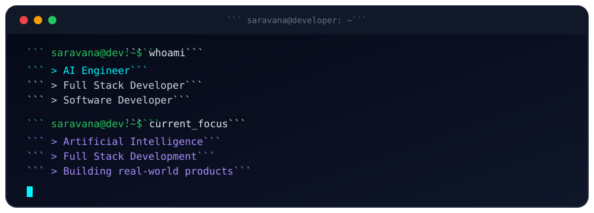

<div align="center">



</div>
<br>
<div align="center">
<a href="https://github.com/SARAVANA-R28">

</a> 
<a href="https://www.linkedin.com/">

</a>


</div>

---

<div align="center">



</div>
<div align="center">

### `Building → Learning → Experimenting → Improving`

</div>

---

<div align="center">

## ⚡ TECH STACK

</div>

<table align="center">
<tr>
<td align="center" width="150">

### 💻 Languages


</td>

<td align="center" width="150">

### 🌐 Frontend


</td>

<td align="center" width="150">

### 🧠 AI / ML


</td>
</tr>

<tr>
<td align="center">

### 🗄️ Database


</td>

<td align="center">

### 🛠️ Tools


</td>

<td align="center">

### 🎨 Design


</td>
</tr>
</table>

---

<div align="center">

## 🤖 WHAT I BUILD

</div>

<table align="center">
<tr>
<td width="50%" valign="top">

### 🧠 Artificial Intelligence

* Machine Learning applications
* AI-powered web applications
* Prediction systems
* Intelligent automation
* Data-driven solutions
* Generative AI exploration

</td>

<td width="50%" valign="top">

### 🌐 Full Stack Development

* Modern responsive websites
* Full-stack applications
* Java applications
* REST APIs
* Database-driven systems
* Interactive user experiences

</td>
</tr>
</table>

---

<div align="center">

## 🚀 FEATURED PROJECTS

</div>

<table align="center">

<tr>
<td width="50%" valign="top">

### 🤖 Hairfall Prediction & Prevention

AI-powered web application focused on predicting hairfall and providing preventive insights.

**Tech:** `Python` `ML` `Web Development`

</td>

<td width="50%" valign="top">

### 🧬 Disease Prediction System

Machine-learning based web application designed to predict possible diseases from user-provided information.

**Tech:** `Python` `Machine Learning` `Web`

</td>
</tr>

<tr>
<td width="50%" valign="top">

### 💊 Pharmacy Drug Management System

Full-stack application developed for managing pharmacy drug information and operations.

**Tech:** `Java` `Database` `Full Stack`

</td>

<td width="50%" valign="top">

### 🚗 Accident Alert System

IoT-based solution designed to detect accidents and trigger an alert mechanism.

**Tech:** `IoT` `Sensors` `Embedded Systems`

</td>
</tr>

<tr>
<td width="50%" valign="top">

### 🌱 Smart Crop Ground Water Monitoring

IoT-based agricultural monitoring system designed to help monitor groundwater conditions.

**Tech:** `IoT` `Sensors` `Monitoring`

</td>

<td width="50%" valign="top">

### 🗑️ Voice Activated Smart Dustbin

Smart automation project combining voice interaction with IoT-based waste-bin control.

**Tech:** `IoT` `Voice Control` `Automation`

</td>
</tr>

</table>

---

<div align="center">

## 🧪 RESEARCH & INNOVATION

</div>

```text
┌─────────────────────────────────────────────────────────────┐
│                                                             │
│  📄 IEEE Research                                           │
│                                                             │
│  Published research work in the field of smart technology   │
│  and intelligent systems.                                   │
│                                                             │
│  💡 Patent                                                  │
│                                                             │
│  Innovation focused on developing practical technology      │
│  solutions and intelligent authentication concepts.         │
│                                                             │
└─────────────────────────────────────────────────────────────┘
```

---

<div align="center">

## 🔭 CURRENTLY

</div>

<table align="center">
<tr>
<td align="center">🔭<br><b>Building</b><br>AI Applications</td>
<td align="center">🌱<br><b>Learning</b><br>AI Engineering</td>
<td align="center">💻<br><b>Developing</b><br>Full Stack Apps</td>
<td align="center">🤖<br><b>Exploring</b><br>Generative AI</td>
<td align="center">🚀<br><b>Goal</b><br>AI Engineer</td>
</tr>
</table>

---

<div align="center">

## 📊 GITHUB ANALYTICS

<br>


<br><br>


</div>

---

<div align="center">

## 📈 CONTRIBUTION GRAPH


</div>

---

<div align="center">

## 🐍 MY CONTRIBUTION JOURNEY


</div>

---

<div align="center">

## 💡 DEVELOPER MINDSET

```text
     THINK
       ↓
    CREATE
       ↓
    BUILD
       ↓
    TEST
       ↓
    IMPROVE
       ↓
    REPEAT 🔁
```

</div>

---

<div align="center">

## 🎯 2026 GOALS

</div>

```text
[████████████████████░░]  AI Engineering
[██████████████████░░░░]  Full Stack Development
[███████████████░░░░░░░]  Generative AI
[██████████████░░░░░░░░]  Open Source
[████████████░░░░░░░░░░]  Build Real Products
```

---

<div align="center">

## 🌐 LET'S CONNECT

<br>

<a href="https://github.com/SARAVANA-R28">

</a>

<a href="https://www.linkedin.com/">

</a>

<br><br>

### `Open to learning • Building • Collaborating • Creating 🚀`

<br>


</div>

